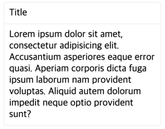

# intesign
 Vanilla JavaScript 디자인 오픈소스 라이브러리

# Grid
### Row
- `static create(...columns)`
```javascript
Row.create(
    Column.create(component, { xxl: 4, xl: 8, lg: 8, md: 8, sm: 12, xs: 24 }),
    Column.create(component, { xxl: 4, xl: 8, lg: 8, md: 8, sm: 12, xs: 24 }),
    Column.create(component, { xxl: 4, xl: 8, lg: 8, md: 8, sm: 12, xs: 24 }),
    Column.create(component, { xxl: 4, xl: 8, lg: 8, md: 8, sm: 12, xs: 24 }),
    Column.create(component, { xxl: 4, xl: 8, lg: 8, md: 8, sm: 12, xs: 24 }),
    Column.create(component, { xxl: 4, xl: 8, lg: 8, md: 8, sm: 12, xs: 24 }),
)
```
### Column
- `static create(node, { xxl, xl, lg, md, sm, xs })`
```javascript
Column.create(component, { xxl: 4, xl: 8, lg: 8, md: 8, sm: 12, xs: 24 })
```
- 총 24 사이즈 
  - ex) `xxl: 4` 는 `1600px`에서 1/6 사이즈
- `xxl: > 1600px`
- `xl: > 1200px`
- `lg: > 992px`
- `md: > 768px`
- `sm: > 576px`
- `xs: < 576px`

# Card
- `static create(head, body)`
```javascript
Card.create('Title', `
  Lorem ipsum dolor sit amet, consectetur adipisicing elit.
  Accusantium asperiores eaque error quasi. Aperiam corporis dicta fuga ipsum laborum nam provident voluptas.
  Aliquid autem dolorum impedit neque optio provident sunt?
`)
```


# Modal
### method
- `create`
  - Modal Element를 생성해서 반환합니다.
  - no parameters 
  - `Modal.create()`: return `<inte-modal></inte-modal>` element
- `appendBody`
  - Modal의 Body를 설정합니다.
  - `Modal.appendBody($modal, component);`
  - parameter
    - $modal: Body를 설정할 Modal Element
    - component: Body에 넣을 component
    - return: `null`
- `appendTitle`
  - Modal의 Title을 설정합니다.
  - `Modal.appendTitle($modal, title);`
  - parameter
    - $modal: Title을 설정할 Modal Element
    - title: Modal의 Title
- `open`
  - Modal을 view에 보이도록 설정합니다.
  - `Modal.open($modal)`
  - parameter
    - $modal: 보이도록 설정할 Modal Element
- `close`
  - Modal을 view에 안보이도록 설정합니다.
  - `Modal.close($modal)`
  - parameter
    - $modal: 안보이게 설정할 Modal Element
- `setWidth`
  - Modal의 너비를 설정합니다. 
  - 단위: `vw`
  - `Modal.setWidth($modal, width)`
  - parameter
    - $modal: 너비를 설정할 Modal Element
    - width: 0 ~ 100 number / default: 50
- `setHeight` (not recommended)
  - Modal의 높이를 설정합니다.
  - 단위: `vh`
  - `Modal.setHeight($modal, height)`
  - parameter
    - $modal: 높이를 설정할 Modal Element
    - width: 0 ~ 100 number / default: content height
- `onOk`
  - Modal 하단의 OK 버튼 이벤트
  - `Modal.onOk($modal, callback)`
  - parameter
    - $modal: OK 버튼 이벤트를 설정할 Modal Element
    - callback: OK 버튼 클릭 시 발생할 이벤트 콜백 함수
- `onCancel`
  - Modal 하단의 CANCEL 버튼 이벤트
  - `Modal.onCancel($modal, callback)`
  - parameter
    - $modal: CANCEL 버튼 이벤트를 설정할 Modal Element
    - callback: CANCEL 버튼 클릭 시 발생할 이벤트 콜백 함수
```javascript
const $modal = Modal.create();

Modal.appendBody($modal, Row.create(
        Column.create(Card.create('hello', 'intae'), { xxl: 4, xl: 8, lg: 8, md: 8, sm: 12, xs: 24 }),
        Column.create(Card.create('hello', 'intae'), { xxl: 4, xl: 8, lg: 8, md: 8, sm: 12, xs: 24 }),
        Column.create(Card.create('hello', 'intae'), { xxl: 4, xl: 8, lg: 8, md: 8, sm: 12, xs: 24 }),
        Column.create(Card.create('hello', 'intae'), { xxl: 4, xl: 8, lg: 8, md: 8, sm: 12, xs: 24 }),
        Column.create(Card.create('hello', 'intae'), { xxl: 4, xl: 8, lg: 8, md: 8, sm: 12, xs: 24 }),
        Column.create(Card.create('hello', 'intae'), { xxl: 4, xl: 8, lg: 8, md: 8, sm: 12, xs: 24 }),
))

document.querySelector('.modal').addEventListener('click', (e) => {
  Modal.open($modal);
})

Modal.onOk($modal, (e) => {
  Modal.close($modal);
});
```
# Message
### method
- create
  - Message Element를 생성해서 반환합니다.
  - no parameters
  - `Message.create()`: return `<inte-message></inte-message>` element
- setMessage
  - Message Element의 보여질 메시지(message)를 설정합니다.
  - `Message.setMessage($message, message)`
  - parameter
    - $message: message를 설정할 Message Element
    - message: Message Element에 설정할 message
- setType
  - Message Element의 보여질 메시지(message) 타입을 설정합니다.
  - `Message.setType($message, type)`
  - parameter
    - $message: type을 설정할 Message Element
    - type: Message Element에 설정할 type 
      - info: 파란색 글씨의 정보메시지
      - error: 붉은색 글씨의 에러메시지
- setVisible
  - Message Element가 보일지 안보일지 설정.
  - `Message.setVisible($message, visible)`
  - parameter
    - $message: visble을 설정할 Message Element
    - visible: Message Element에 설정할 visible
      - open
      - close


# Example
더 많은 작업을 진행하면서 추가할 예정입니다.
```html
<!DOCTYPE html>
<html>
    <head>
        <meta charset="UTF-8">
        <meta name="viewport" content="width=device-width, initial-scale=1.0">
        <meta http-equiv="X-UA-Compatible" content="ie=edge">
        <title></title>
    </head>
    <body>
    <inte-button name="modal" class="modal"></inte-button>
    <inte-button name="message" class="message"></inte-button>
    <script type="module" src="app.js"></script>
    <inte-modal visible="true" title="hello"></inte-modal>
    </body>
</html>

```

```javascript
import { Card, Column, Message, Modal, Row } from './index.js';


// Column.create(Card.create('Hello', 'Intae'), {xxl: 8, xl: 8, lg: 8, md: 8, sm: 8, xs: 24}),
const $modal = Modal.create();

const loremStr = `Lorem ipsum dolor sit amet, consectetur adipisicing elit.
Accusantium asperiores eaque error quasi. Aperiam corporis dicta fuga ipsum laborum nam provident voluptas.
Aliquid autem dolorum impedit neque optio provident sunt?`

document.body.append(
  Row.create(
    Column.create(Card.create('Title', loremStr), { xxl: 4, xl: 8, lg: 8, md: 8, sm: 12, xs: 24 }),
    Column.create(Card.create('Title', loremStr), { xxl: 4, xl: 8, lg: 8, md: 8, sm: 12, xs: 24 }),
    Column.create(Card.create('Title', loremStr), { xxl: 4, xl: 8, lg: 8, md: 8, sm: 12, xs: 24 }),
    Column.create(Card.create('Title', loremStr), { xxl: 4, xl: 8, lg: 8, md: 8, sm: 12, xs: 24 }),
    Column.create(Card.create('Title', loremStr), { xxl: 4, xl: 8, lg: 8, md: 8, sm: 12, xs: 24 }),
    Column.create(Card.create('Title', loremStr), { xxl: 4, xl: 8, lg: 8, md: 8, sm: 12, xs: 24 }),
  ),
  $modal,
);


Modal.appendBody($modal, Row.create(
  Column.create(Card.create('hello', 'intae'), { xxl: 4, xl: 8, lg: 8, md: 8, sm: 12, xs: 24 }),
  Column.create(Card.create('hello', 'intae'), { xxl: 4, xl: 8, lg: 8, md: 8, sm: 12, xs: 24 }),
  Column.create(Card.create('hello', 'intae'), { xxl: 4, xl: 8, lg: 8, md: 8, sm: 12, xs: 24 }),
  Column.create(Card.create('hello', 'intae'), { xxl: 4, xl: 8, lg: 8, md: 8, sm: 12, xs: 24 }),
  Column.create(Card.create('hello', 'intae'), { xxl: 4, xl: 8, lg: 8, md: 8, sm: 12, xs: 24 }),
  Column.create(Card.create('hello', 'intae'), { xxl: 4, xl: 8, lg: 8, md: 8, sm: 12, xs: 24 }),
))

document.querySelector('.modal').addEventListener('click', (e) => {
  Modal.open($modal);
})

const $message = document.createElement('inte-message');
Message.setMessage($message, '데이터를 받아오지 못했습니다.');
Message.setType($message, 'error');
document.body.append($message);

document.querySelector('.message').addEventListener('click', (e) => {
  $message.setAttribute('visible', 'open');
  setTimeout(() => {
    $message.setAttribute('visible', 'close');
  }, 3000)
})

Modal.onOk($modal, (e) => {
  Modal.close($modal);
});

Modal.onCancel($modal, (e) => {
  Modal.close($modal);
})
```

예제 링크: https://intesign-example.herokuapp.com/